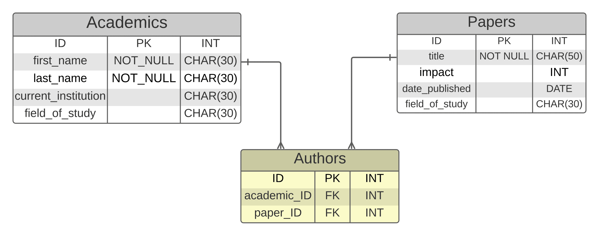
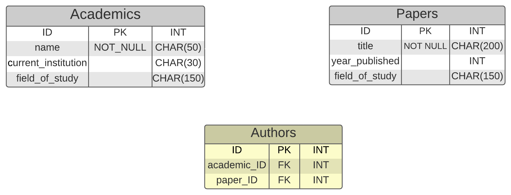
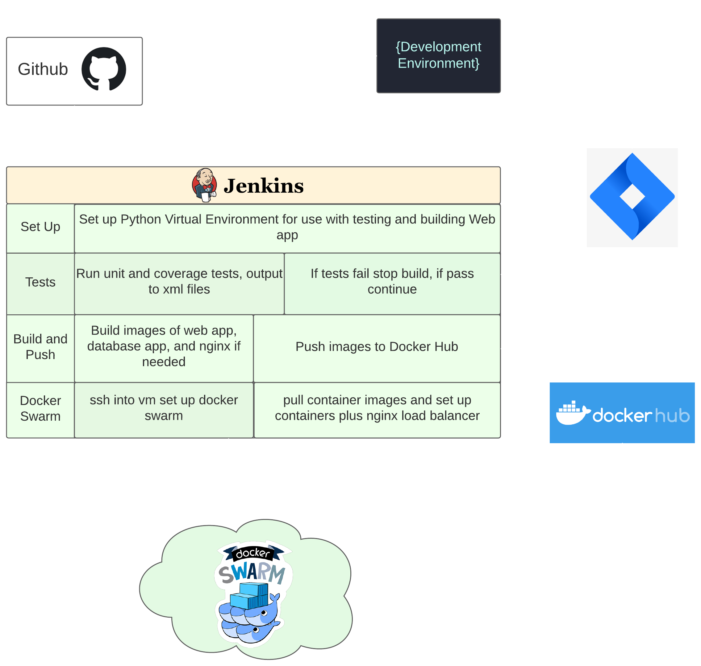
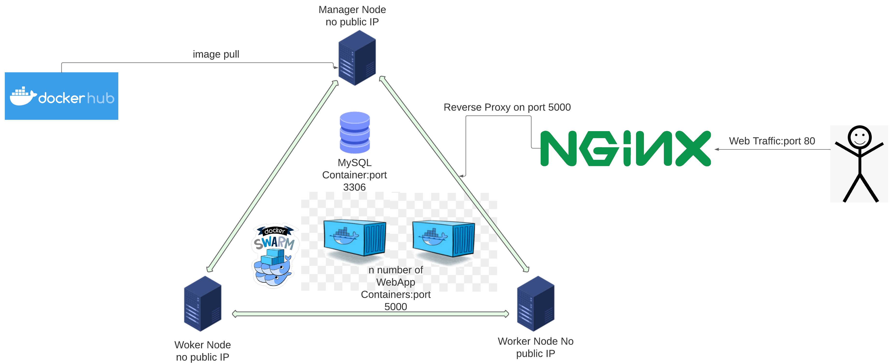

# Academic Journal Database

Links to Jira and Risk assesment go here.

## Contents
1. Brief (#brief)
2. Project Design (#project-design)
3. Database Design (#databse-design)
4. HTML Templates (#html-templates)
5. CI/CD pipeline (#ci/cd-pipeline)
6. Docker Deployment (#docker-deployment)
7. Project Planning and Version Source Control(#project-planning-and-version-source-control)

## Brief
-   Create a web application that integrates with a database and demonstrates CRUD functionality.
    -   To be a monolithic Flask application that serves both front and back end of the application.
    -   Front end to use HTML templates to serve web pages that allow the user to perform CRUD functionality with information from the database
    -   Frontend of application to use SQLAlchemy to model an integrate with database
    -   Application to be hosted in a container to allow it to be deployed in a docker swarm    
    -   Application must interface with a seperate database service, either a MySQL container or possibly MySQL Database for Azure.
    -   The Database must contain two tables with a relationship, either one-to-many or many-to-many (This project uses many-to-many)
    -   pytest to be used to write unit tests with the aim of acheiving high coverage.

 

-   Create a continuous integration CI/CD using Jenkins. 
    -   The pipeline must:
        -   Run unit tests.
        -   Build Dockers images
        -   Push the docker images to a registry
        -   Deploy to a swarm
            -   hosted in the cloud
            -   at least one manager node and one worker node, neither of whch are the Jenkins server
        -   use a webhook from a remote repository to trigger the pipeline
        
  

-   All code, configuration files, and any related scripts to be contained in a Github repository with a write up of the project in a README.md file.
-   A video to be provided with evidence of the application and the CI/CD pipeline working.

 

## Project Design

### The application was designed to fulfill the must have features as given by the brief:
-   Two tables with a relationship between them
    -   Application has an Academics and a Papers Table
-   Front end to interact with database using SQLAlchemy
    -   Front end comprises of a home page in which the user can search the database and return the linked relational entries on the other table, as well as pages that allow to create, delete and update objects.
-   Jenkins is the CI/CD server it automates testing and deployment to docker swarm
-   The Docker swarm runs on at least one manager node and currently two worker nodes, it runs a MYSQL Container and a number of front end containers. 

### It also has some features that went above the basic brief but add add functionality(should have):
-   Ability for the user to update every attribute for an object in both tables
-   A many-to-many relationship between the two tables
-   Some extra attributes beyond the titles and the authors
-   CAN'T DELETE LAST AUTHOR OF PAPER
-   INTEGRATION TESTING 
-   The docker swarm is on three nodes with have no public IP adresses, with the only access to the internet cotrolled by NGINX container sat on a seperate VM.  

### If there was more time or the database would ever actually be used here are some fetaures it could have:
-   Ability to filter search results, i.e. all papers from a certain year, or all authors in certain field of study.
-   create seperate tables to track institutions and fields of study rather than have them entered via string each time they are created or updated
-   ability to hyperlink names of objects to a search for that attribute
-   run tests in a container rather than on jenkins server

### There were some intital ideas I had on the design of the web application that I decided where unecessary(Will not have):
-   Impact (a measure of how important a paper is in it's field) dropped as it added little
-   First and Last name of Academics merged into one field as it added no extra information
-   Date of publication changed to year of publication as that level of detail is not needed for fictional documents

## Database design

this is a many to many relational database, which as SQL doesn't accompdate contains a child table.
The database holds nonsesical academic papers, some with multiple authors, and with academics who author many papers.
I originally planned for a few different attributes to each table to add a bit of detail to the information, but scaled it back as it didn't add much, and wasn't interesting.

### 
Original Entity Relationship Diagram

  

### 
New Entity Diagram

  

 

## HTML Page functionality

Home page is also the main search page. The databse is auto populated with some data (20 objects in each table). The search functions are done through select fields, with the update, and create functions done through entering strings. 

### Home Page
-   Search academic, returns Academic, name, Current Institution and Field of Study, also return all papers the Academic has authored.
-   Search paper, returns year published, field of study and all authors

### Create page (one for academic and one for paper)
-   academics can be created without any papers but papers must have at least one author and a maximum of 4. Authors and the Year published attributes are chosen through Select Fields.
-   academics can have no institution both Academics and Papers can have no field of study
-   when creating papers multiple authors will have to be selected and these id's will be added to the authors(child) table, along with the paper ids

### Update function (one for academic and one for paper)
-   change academic name, institution or field of study
-   change papers title, authors (from a select field of existing authors), year published(select field) and field of study.
-   If any field that isn't a select field is left blank the attribute will not be updated

### Delete function (one for academic and one for paper)
-   delete academic (chosen from select field), however if academic last author related to a paper the paper must be deleted first.
-   delete paper (chosen from select field)

### About Page
- Basic information about the app

### CI/CD Pipeline
Prequisites:  
-   VM with Jenkins (plugin cobertura) and docker installed
-   4 VMs with docker installed 
-   All VMs to be on the same Vnet (Azure does this by default)

### 
CI/CD Pipeline Diagram

Pipeline process:  
-   Git sends an changes to the dev branch to Jenkins
-   Jenkins runs unit tests if they fail it sends an email to the developer (me!)
-   If the tests pass Jenkins builds containers for the mysql database and web apps and pushes them to docker hub
-   Jenkins SSHs into vm sets up manager node (installing Docker) and then SSHs into the two worker nodes )also installing Docker) to set up the swarm
-   jenkins pulls down the images from dockerhub and sets up a mysql service with one container, attached to a volume, and N number of web-app containers.
- Jenkins then SSHs into another VM to set up docker and a NGINX container to act as a load balancer and reverse proxy 

### Docker deployment
-   Docker will be installed on 4 VM's, three to be part of a docker swarm and another to be a load balancer and reverse proxy running NGINX
-   The docker swarm will contain one mysql database linked to a volume for data persistance and a number of web-app containers.

### 
Deployment Diagram

    

## Project Planning and Version Source Control

Thr project planning was done on Jira, originally using sprints but that was cumbersum and unwieldy for a team of one. It was difficult to judge what would be a simple task or something that would take hours to make work.  
in Github I split the dev branch from the main, and then split feature branches from the dev branch. Early on I mistakenly created new feature branches whithout merging the previous features back which caused me a lot of headaches, and merge conflicts, once I realised and tried to merge them alltogether. However this did giver me some good experience of dealing with merge conflicts and motivation to avoid them in the future!

tasks to do

Add validation method to make sure title of paper is unqiue // stretch goal to see if paper is too similair to another?

add these things to Jira

add method to do partial search and allow furhter filtering

possible to hyperlink results to take to details of object? could be done using variable in the url, would 

make it so that papers can't be authorless

failed tests send email to user

tests are run in a container

Things found hard

Git branching - forgot to merge then branched new features from dev branch which was behind on commits, caused a headache when fixing conflicts

unit testing - struggled to understand exactly what to pass in a dictionary for post tests

sqlcontainer - wanted to prepopulate container with information. 

