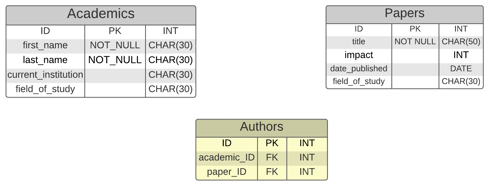
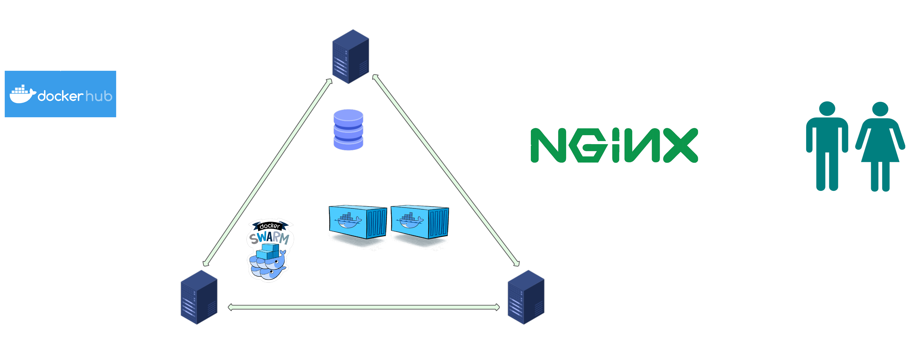

# Academic Journal Database 

 
[<p>Link to 9 min video showing the CRUD operation of the webapp and the CI/CD Pipeline in Operation</p>](https://1drv.ms/u/s!Agf77aE1B_XKfYzJc0lmOFNnlsE?e=yQS0AC) 
[<p>Link to a short 4:30min video showing some of the CRUD operation of the webapp and the CI/CD Pipeline in Operation</p>](https://1drv.ms/u/s!Agf77aE1B_XKfuysmK6z_J5crxU?e=OgZkGx) 

 The run_on_local_machine branch contains a stripped down version of the webapp which runs the database with SQLlite. To see intructions on how to run it see [Instructions](#instructions) at the end of the readme.

## Contents 

1. [Brief](#brief) 

2. [Project Design](#project-design) 

3. [Database Design](#databse-design) 

4. [HTML Templates](#html-templates) 

5. [CI/CD pipeline](#ci/cd-pipeline) 

6. [Unit Tests](#unit-tests)

7. [Docker Deployment](#docker-deployment) 

8. [Security and Risk Assessment](#security-and-risk-assessment) 

9. [Project Planning and Version Source Control](#project-planning-and-version-source-control) 

 
 
 

## <a name="brief"></a>Brief 

-   Create a web application that integrates with a database and demonstrates CRUD functionality. 

    -   To be a monolithic Flask application that serves both front and back end of the application. 

    -   Front end to use HTML templates to serve web pages that allow the user to perform CRUD functionality with information from the database 

    -   Frontend of application to use SQLAlchemy to model an integrate with database 

    -   Application to be hosted in a container to allow it to be deployed in a docker swarm     

    -   Application must interface with a separate database service, either a MySQL container or possibly MySQL Database for Azure. 

    -   The Database must contain two tables with a relationship, either one-to-many or many-to-many (This project uses many-to-many) 

    -   pytest to be used to write unit tests with the aim of achieving high coverage. 

 
 

<br> 

 
 

-   Create a continuous integration CI/CD using Jenkins.  

    -   The pipeline must: 

        -   Run unit tests. 

        -   Build Dockers images 

        -   Push the docker images to a registry 

        -   Deploy to a swarm 

            -   hosted in the cloud 

            -   at least one manager node and one worker node, neither of which are the Jenkins server 

        -   use a webhook from a remote repository to trigger the pipeline 

         

<br>  

 
 

-   All code, configuration files, and any related scripts to be contained in a Github repository with a write up of the project in a README.md file. 

-   A video to be provided with evidence of the application and the CI/CD pipeline working. 

 
 

<br> 

 
 

## <a name="project-design"></a>Project Design 

 
 

**The application was designed to fulfil the must have features as given by the brief:** 

-   Two tables with a relationship between them 

    -   Application has an Academics and a Papers Table 

-   Front end to interact with database using SQLAlchemy 

    -   Front end comprises of a home page in which the user can search the database and return the linked relational entries on the other table, as well as pages that allow to create, delete and update objects. 

-   Jenkins is the CI/CD server it automates testing and deployment to docker swarm 

-   The Docker swarm runs on at least one manager node and currently two worker nodes, it runs a MYSQL Container and a number of front end containers.  

 
 

**It also has some features that went above the basic brief but add functionality(should have):** 

-   Ability for the user to update every attribute for an object in both tables 

-   A many-to-many relationship between the two tables 

-   Some extra attributes beyond the titles and the authors 

-   The docker swarm is on three nodes (a very minor and easy to make change) 

-   NGINX used as a load balancer/reverse proxy sat on a different machine 

-   Jenkins updates developer via email

-   Database pre-populated with some data to search for and look at

-   Logic in the flask app recognises if deleting an academic will leave a paper without an author and blocks it, it also recognises if a paper being created or deleted has the same name as another paper and prevents it before the database returns an error.       

 
 

**If there was more time or the database would ever actually be used here are some features it could have:** 

-   Ability to filter search results, i.e. all papers from a certain year, or all authors in certain field of study. 

-   create separate tables to track institutions and fields of study rather than have them entered via string each time they are created or updated 

-   ability to hyperlink names of objects to a search for that attribute 

-   run tests in a container rather than on jenkins server - tried to implement this but couldn't get the Jenkins server to recognise failed tests (i.e. it passed the stage as long as the container was built and run).  

-   Docker volume to persist database data 

-   Integration testing 

-   Login feature to restrict some CRUD functionality to administrators 

-   With a lot more time it could be split in a number of microservices and generate the nonsensical names and paper titles itself 

 

 **There were some initial ideas I had on the design of the web application that I decided where unnecessary or out of scope of project(Will not have):** 

-   Impact (a measure of how important a paper is in its field) dropped as it added little 

-   First and Last name of Academics merged into one field as it added no extra information 

-   Date of publication changed to year of publication as that level of detail is not needed for fictional documents 

 
 
 

## <a name="database-design"></a>Database design 

 
 

this is a many to many relational database, which as SQL doesn't accommodate also contains a child table. 

The database holds nonsensical academic papers, some with multiple authors, and with academics who author many papers. 

I originally planned for a few different attributes to each table to add a bit of detail to the information, but scaled it back as it didn't add much, and wasn't interesting. 

 
 

### <p align="center">**Original Entity Relationship Diagram**</p> 

 
 

<p align="center">  </P> 

 
 

### <p align="center">New Entity Diagram</p> 

 
 

<p align="center">  </p> 

<br> 

 
 

## <a name="html-templates"></a>HTML Page functionality 

 
 

Home page is also the main search page. The database is auto populated with some data (20 objects in each table). The search functions are done through select fields, with the update, and create functions done through entering strings.  

 
 

### Home Page 

-   Search academic, returns Academic, name, Current Institution and Field of Study, also return all papers the Academic has authored. 

-   Search paper, returns year published, field of study and all authors 

 
 

### Create page (one for academic and one for paper) 

-   academics can be created without any papers but papers must have at least one author and a maximum of 4. Authors and the Year published attributes are chosen through Select Fields. 

-   academics can have no institution both Academics and Papers can have no field of study 

-   when creating papers multiple authors will have to be selected and these id's will be added to the authors(child) table, along with the paper ids 

 
 

### Update function (one for academic and one for paper) 

-   change academic name, institution or field of study 

-   change papers title, authors (from a select field of existing authors), year published(select field) and field of study. 

-   If any field that isn't a select field is left blank the attribute will not be updated 

 
 
 

### Delete function (one for academic and one for paper) 

-   delete academic (chosen from select field), however if academic last author related to a paper the paper must be deleted first. 

-   delete paper (chosen from select field) 

 
 

### About Page 

- Basic information about the app 

 
 

### <a name="ci.cd-pipeline"></a>CI/CD Pipeline 

Perquisites:   

-   VM with Jenkins (plugin cobertura) and docker installed 

-   4 VMs with docker installed  

-   All VMs to be on the same Vnet (Azure does this by default) 

 
 

### <p align="center">**CI/CD Pipeline Diagram**</P> 

<p align="center"></p> 

 
 
 
 

## Pipeline process:   

-   Git sends an changes to the dev branch to Jenkins 

-   Jenkins runs unit tests  

-   If the tests pass Jenkins builds containers for the mysql database and web apps and pushes them to docker hub 

-   Jenkins SSHs into vm sets up manager node (installing Docker) and then SSHs into the two worker nodes )also installing Docker) to set up the swarm 

-   jenkins pulls down the images from dockerhub and sets up a mysql service with one container, attached to a volume, and N number of web-app containers. 

- Jenkins then SSHs into another VM to set up docker and a NGINX container to act as a load balancer and reverse proxy 

- Jenkins sends email to developer (me) with console log of build  

 
 ## <a name="unit-tests"></a> Unit Tests
 -  The unit tests are run in the jenkins machine using a Python virtual environment. The tests provide 100% coverage, with the reports for the unit tests and coverage placed into xml files and published in the jenkins pipeline with JUnit and Cobertura. 

### <p align='center'> Test Results from Jenkins Pipeline</p>

 <p align='center'></p> 

 -  As the unit tests only tests the functions in the routes.py file (and the code they depend on) they don't pick up any problems with the SQL database itself. If the SQL image is created successfully, but the database has a problem neither the pipeline or the tests will pick this up. This is mentioned in the risk assessment. 
 

## <a name="docker-deployment"></a>Docker deployment 

-   Docker will be installed on 4 VM's, three to be part of a docker swarm and another to be a load balancer and reverse proxy running NGINX 

-   The docker swarm will contain one mysql database and a number of web-app containers. 

 
 

### <p align="center">Deployment Diagram</p> 

<p align="center"></p> 

     

## <a name='security-and-risk-assessment'></a> Security and Risk Assessment 

-   Care was taken to hide any potential sensitive credentials (i.e. database URI, database password, CSRF secret key) by embedding them into jenkins secrets and passing them as environmental variables through the jenkins file into the docker container environments. This is not fool proof as the variables can still be accessed by docker exec and printenv, although if a bad actor has gotten that far into the internal working of the app the secret credentials will be a minor security concern.  

-   I would have liked ideally to have the three docker swarm nodes to not have any public IPS, and be accessible only via ssh from the jekins server, or via http from the NGINX server, however there was an intractable problem in which VM's could not be accessed via port 5000 on their private IP address (although they could be pinged, and ssh's into from each other), the workaround for this was to give them a public IP address and restrict access to port 5000 to only the IP of the NGINX server. This could be a potential weakness if someone could spoof their IP address. 

-   However all the above security concerns are hypothetical only as the database itself is completely open for all CRUD functionality to anyone who wishes to connect via HTTP. This could be solved via a login service but it was out of scope for this project. 

 
 

### [Risk Assessment](https://docs.google.com/spreadsheets/d/1OR0j97-njF4Uo9A0Qwf9w5LErSOfL9MrZ83-rRdKCvo/edit?usp=sharing) 

 
 

<p align='center'></p> 

 
 

[<p align='center'>Link to risk assessment</p>](https://docs.google.com/spreadsheets/d/1OR0j97-njF4Uo9A0Qwf9w5LErSOfL9MrZ83-rRdKCvo/edit?usp=sharing) 

 
 
 

## <a name="project-planning-and-version-source-control"></a> Project Planning and Version Source Control 

 
 

The project planning was done on Jira, originally using sprints but that was cumbersome and unwieldy for a team of one. It was difficult to judge what would be a simple task or something that would take hours to make work.   

in Github I split the dev branch from the main, and then split feature branches from the dev branch. Early on I mistakenly created new feature branches without merging the previous features back which caused me a lot of headaches, and merge conflicts, once I realised and tried to merge them altogether. However this did give me some good experience of dealing with merge conflicts and motivation to avoid them in the future! 

 
 

<p align='center'></p> 

 
 

[<p align='center'>Link to Invite for Jira Board (will only be avaialbe until the 10th of April 2022</p>](https://id.atlassian.com/invite/p/jira-software?id=P2viWtRxTPGvon5o5lRumQ) 
 
 
 # <a name='instructions'></a>Instructions to run Application on local machine.
 
 Programs you will need.
 -  GIT
 -  Python
 -  pip normally bundled with python
 -  python virtual environment

 1. clone the correct branch by entering the following into bash
 '''sh  
 git clone -b run_on_local_machine https://github.com/Cleon909/QA_final_project.git
 '''

2. cd into the QA_final_project folder and create a virtual environment for the python modules
```sh  
python -m venv venv
source venv/bin(or Scripts on windows)/activate
pip install -r requirement.txt
```

3. create the database  
```sh  
python create.db
```

4. run the app  
```sh  
python app.py
```

5. The terminal will give you the ip address to enter into your browser to view the app.

 
 
 
 
 
 
 
 
 
 

 